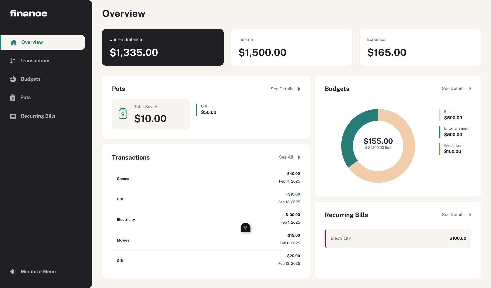

# Frontend Mentor - Personal finance app solution

This is a solution to the [Personal finance app challenge on Frontend Mentor](https://www.frontendmentor.io/challenges/personal-finance-app-JfjtZgyMt1). Frontend Mentor challenges help you improve your coding skills by building realistic projects.



## Features

- 🔐 User Authentication
- 📊 See all of the personal finance app data at-a-glance on the overview page
- 📜 View all transactions on the transactions page with pagination for every ten transactions
- ➕ Add new transaction and mark a transaction as void
- 🔍 Search, sort, and filter transactions
- 📅 Create, read, update, delete (CRUD) budgets and saving pots
- 📂 View the latest three transactions for each budget category created
- 📈 View progress towards each pot
- 💰 Add money to and withdraw money from pots
- 🏦 View recurring bills and the status of each for the current month
- 🔄 Search and sort recurring bills
- ⚠️ Receive validation messages if required form fields aren't completed
- ⌨️ Navigate the whole app and perform all actions using only their keyboard
- 📱 View the optimal layout for the interface depending on their device's screen size

## Project setup

1. Clone repository

```bash
    git clone git@github.com:Raphico/personal-finance-app.git
    cd personal-finance-app
```

2. Install dependencies

```bash
    pnpm install
```

3. setup env
4. start development server

```bash
  pnpm run dev
```

## Technical stack

- [Vue](https://vuejs.org/)
- [Node](https://nodejs.org/)
- [Express](https://expressjs.com/)
- [Postgres](https://www.postgresql.org/)
- [Redis](https://redis.io/)
- [JWT](https://www.npmjs.com/package/jsonwebtoken)
- [Drizzle-ORM](https://orm.drizzle.team/)
- [Zod](https://zod.dev/)
- [Playwright](https://playwright.dev/docs/intro)
- [Vitest](https://vitest.dev/)

## License

Licensed under the MIT License. Check the [LICENSE](./LICENSE) file for details.
